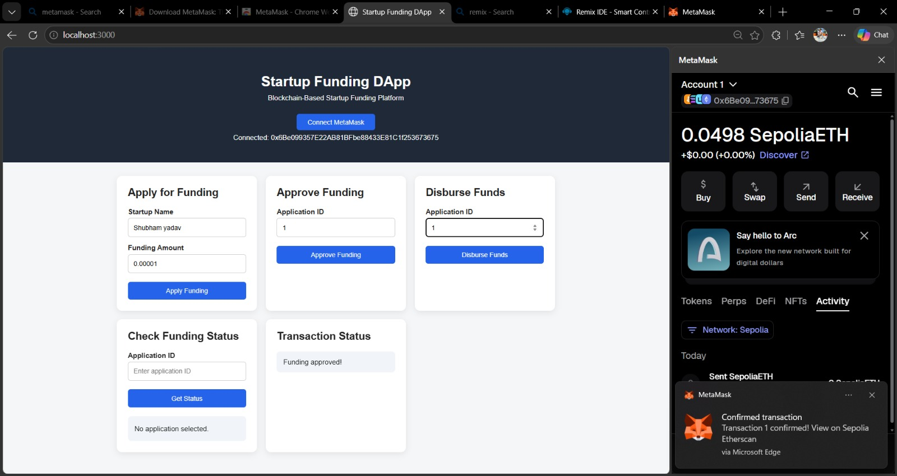
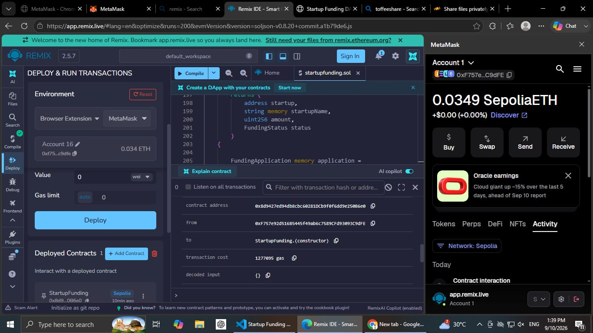
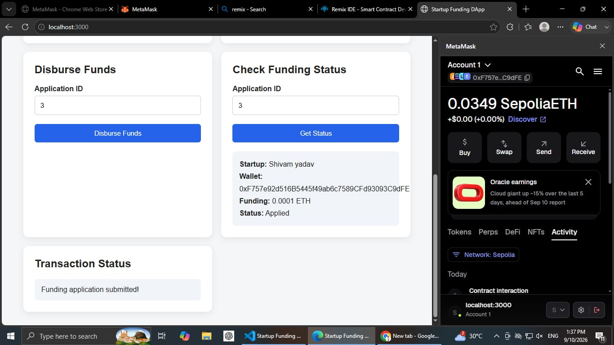

# 🚀 Startup Funding DApp

A blockchain-based decentralized application for managing startup funding using **Ethereum Smart Contracts**.

Startups can apply for funding, the owner can approve applications, and approved funds can be securely disbursed to the startup's wallet through the blockchain.

## 📸 Screenshots

### DApp Interface


### Smart Contract Deployment


### Funding Status


### Fund Disbursement


## ✨ Features

- 🦊 MetaMask wallet integration
- 📝 Apply for startup funding
- ✅ Approve funding applications
- 💸 Disburse ETH funds
- 🔎 Check funding status
- ⛓️ Ethereum blockchain integration
- 🌐 Sepolia testnet support

## 🔄 Workflow

```text
Connect MetaMask
       ↓
Apply for Funding
       ↓
Application Created
       ↓
Approve Funding
       ↓
Disburse Funds
       ↓
Startup Receives ETH
```

## 🛠️ Tech Stack

- **Solidity** – Smart Contract
- **Ethereum Sepolia** – Blockchain Network
- **MetaMask** – Wallet
- **ethers.js** – Web3 Integration
- **HTML / CSS / JavaScript** – Frontend
- **Node.js / Express.js** – Local Server
- **Remix IDE** – Smart Contract Deployment

## 📁 Project Structure

```text
StartupFundingDApp/
│
├── Contracts/
│   └── StartupFunding.sol
├── Public/
│   ├── index.html
│   ├── style.css
│   └── app.js
├── screenshots/
│   ├── 1.jpg
│   ├── 2.jpeg
│   ├── 3.jpeg
│   └── 4.jpeg
├── server.js
├── package.json
└── README.md
```

## ⚙️ Run Locally

### 1. Clone the repository

```bash
git clone https://github.com/YOUR_USERNAME/startup-funding-dapp.git
cd startup-funding-dapp
```

### 2. Install dependencies

```bash
npm install
```

### 3. Start the server

```bash
node server.js
```

Open:

```text
http://localhost:3000
```

## ⛓️ Smart Contract

The `StartupFunding.sol` contract manages:

- Funding applications
- Application approval
- Fund disbursement
- Funding status

Applications contain the startup's:

```text
Startup Name
Wallet Address
Funding Amount
Application Status
```

## 🔐 Security

The contract uses **owner-based access control**, allowing only the contract owner to approve applications and disburse funds.

> ⚠️ This project uses the **Sepolia testnet** and is intended for educational purposes.


⭐ If you found this project useful, consider giving the repository a star!
